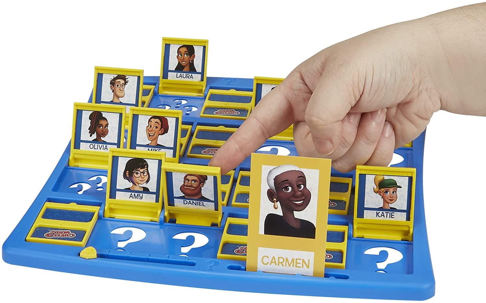

# 0501 - Decision trees based algorithms
[Draft]

Have you ever played with the board game "Guess Who?" when you was a child ? The game objective was to find a particular character by asking questions related to its characteristics, like the sex, the colour of the barb or the eyes, etc...

Decisions trees are the collections of "questions" that you pose, relative to some data characteristics (the _features_, in ML jargon), to arrive determining some other unknown characteristics (the _labels_).
In the board game the unknown characteristics is the name of the character, and it is unique across the board.
But more in general it can be a characteristic shared by many individuals. For example we could play "Guess Who?" with the objective to determine the sex of the character (without of course the possibility to ask about it).

It then become obvious that the "best" question is those that can split our records the most evenly possible in groups based on the desired feature. In the example above asking if the character has the barb it would likelly be a good question. 

Decision trees algorithms are algorithms that indeed learn from the data to ask the "best" questions to arrive to features in the shortest possible term, i.e. by posing the less amount of questions.
